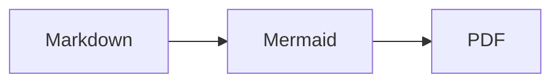
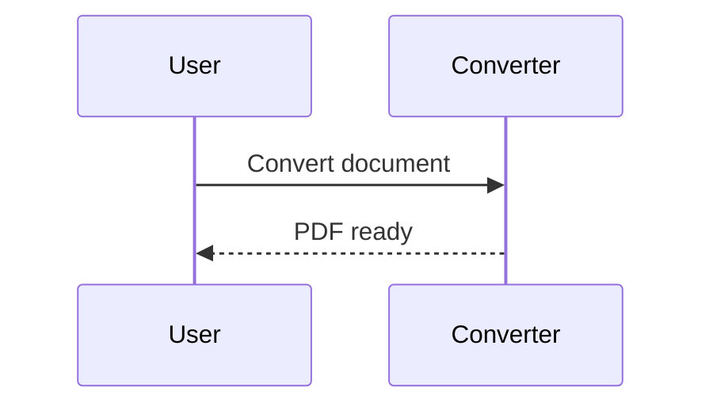

# Markdown PDF 변환기 (md-changer)

Markdown을 Playwright Chromium으로 A4 PDF로 변환하는 Windows GUI 및 CLI입니다. Python **3.13 이상**과 `uv`를 사용합니다. Mermaid 다이어그램, 네 가지 테마, 사용자 CSS와 파일별 변환 결과를 지원합니다.

## 패치 노트 — 테마·Mermaid·안전한 일괄 변환

- `default`, `modern`, `minimal`, `report` 문서 테마와 사용자 CSS 파일 적용을 추가했습니다.
- ` ```mermaid ` 코드 블록을 로컬 Mermaid 11.17.2 런타임으로 렌더링합니다. CDN 없이 동작하며, 다이어그램 오류가 난 파일만 실패 처리하고 다음 파일을 계속 변환합니다.
- CLI와 GUI 모두 파일별 성공·실패 결과를 보여줍니다. CLI의 `--json`은 부분 성공과 오류를 구조화해 반환합니다.
- 같은 이름의 PDF를 덮어쓰지 않고 `name-2.pdf`, `name-3.pdf`처럼 자동으로 이름을 분리합니다.
- 포터블 EXE와 wheel/uvx 패키지에 Mermaid 런타임 및 라이선스를 포함하도록 빌드 구성을 보완했습니다.

## 설치 및 CLI

소스 실행은 Python 의존성과 Chromium을 먼저 설치합니다. 최초 설치에는 네트워크가 필요합니다.

```powershell
uv sync --group build
$env:PLAYWRIGHT_BROWSERS_PATH = Join-Path (Get-Location) "ms-playwright"
uv run playwright install chromium
uv run python main.py -i document.md -o output --theme modern --json
```

로컬 소스로 설치·실행하는 `uvx` 명령도 지원합니다. 위의 절대 경로 `PLAYWRIGHT_BROWSERS_PATH` 설정을 유지하면 다운로드한 Chromium을 사용할 수 있습니다.

```powershell
uvx --from . md-changer -i document.md -o output --theme report --css custom.css --json
```

가상환경을 이미 만든 개발 환경에서는 다음처럼 직접 실행할 수 있습니다.

```powershell
.\.venv\Scripts\python.exe main.py -i document.md -o output --theme modern --json
```

여러 파일 또는 폴더를 한 번에 지정할 수도 있습니다.

```powershell
uv run python main.py -i docs\guide.md docs\release-notes.md docs\manuals -o output --theme report
```

`-i` / `--input`은 파일 또는 폴더를 여러 개 받습니다. 폴더는 하위 폴더까지 검색하며 `.md`, `.markdown` 확장자를 대소문자 구분 없이 처리합니다. 중복 입력은 제거합니다. `-o` / `--output` 생략 시 첫 번째 발견 파일의 폴더에 저장합니다. 기존 PDF를 덮어쓰지 않고 `document.pdf`, `document-2.pdf`, `document-3.pdf` 순으로 빈 이름을 사용합니다. 같은 이름을 가진 여러 입력에도 적용됩니다.

`--quiet` / `-q`는 일반 진행 메시지를 숨깁니다. `--json`을 함께 쓰면 JSON 결과는 계속 출력합니다.

### CLI 옵션 요약

| 옵션 | 설명 |
| --- | --- |
| `-i`, `--input PATH [PATH ...]` | 변환할 Markdown 파일 또는 재귀 검색할 폴더를 하나 이상 지정합니다. |
| `-o`, `--output PATH` | PDF 출력 폴더를 지정합니다. 생략하면 첫 번째 입력 파일의 폴더를 사용합니다. |
| `--theme NAME` | `default`, `modern`, `minimal`, `report` 중 문서 테마를 선택합니다. |
| `--css PATH` | 선택한 테마 뒤에 적용할 UTF-8 CSS 파일을 지정합니다. |
| `-q`, `--quiet` | 일반 진행 메시지를 숨깁니다. 오류는 stderr에 계속 출력합니다. |
| `--json` | 성공·부분 성공·오류 결과를 JSON 한 개로 stdout에 출력합니다. 자동화에 적합합니다. |

전체 옵션은 다음 명령으로 확인할 수 있습니다.

```powershell
uv run python main.py --help
```

## 테마와 CSS

| `--theme` 값 | GUI 표시 | 스타일 |
| --- | --- | --- |
| `default` (기본값) | 기본 | 기존 기본 스타일 |
| `modern` | 모던 | 파란색 제목, 넉넉한 제목 간격 |
| `minimal` | 미니멀 | 회색 계열, 간결한 제목 |
| `report` | 문서/리포트 | 남색 제목, 밀도 높은 표 |

CSS는 **공통 인쇄 CSS → 선택한 테마 CSS → 사용자 CSS** 순서로 합쳐집니다. 일반 CSS cascade 규칙(선택자 우선순위, `!important`, 같은 우선순위의 선언 순서)이 적용됩니다. `--css PATH`는 UTF-8 파일을 읽으며, 파일이 없거나 읽을 수 없으면 브라우저 시작 전에 실패합니다. 테마는 해당 작업의 모든 문서와 Mermaid 색상에 적용됩니다.

## Mermaid와 오프라인 동작

언어 이름이 `mermaid`인 fenced code block을 사용합니다.

````markdown



````

일반 코드 블록은 그대로 유지됩니다. 다이어그램과 글꼴 준비를 기다린 뒤 PDF를 생성합니다. Mermaid 구문 오류나 30초 렌더링 대기 시간 초과는 해당 파일의 실패로 기록되며, 일괄 작업의 다음 파일은 계속 처리합니다.

Mermaid JavaScript와 MIT 라이선스는 패키지에 포함되어 CDN을 사용하지 않습니다. 렌더링은 Chromium의 offline 모드로 실행하므로 원격 이미지·글꼴·CSS 등 네트워크 리소스를 사용할 수 없습니다. 문서 기준 상대 경로의 로컬 리소스를 사용하세요. Chromium 설치 이후 변환에는 네트워크가 필요하지 않으며, 포터블 배포본에는 Chromium도 포함됩니다.

## JSON과 종료 코드

`--json`은 stdout에 JSON 객체 하나를 출력합니다. 파일별 실패가 있어도 나머지 파일을 계속 변환합니다.

```json
{
  "status": "partial",
  "converted_count": 1,
  "failed_count": 1,
  "output_directory": "C:\\docs\\output",
  "theme": "modern",
  "custom_css": null,
  "files": [
    {"source": "C:\\docs\\good.md", "pdf": "C:\\docs\\output\\good.pdf", "status": "success", "error": null},
    {"source": "C:\\docs\\bad.md", "pdf": null, "status": "error", "error": "Mermaid rendering failed: ..."}
  ]
}
```

최상위 `status`는 모두 성공하면 `success`, 일부 성공하면 `partial`, 성공이 없거나 작업 시작에 실패하면 `error`입니다. `custom_css`는 지정한 CSS의 절대 경로 또는 `null`입니다. 입력 검증·브라우저 시작 등의 작업 수준 오류에는 `message`가 추가되고 `files`는 빈 배열입니다. 이때 개수는 모두 0이며, 아직 결정되지 않은 `output_directory`는 `null`일 수 있습니다. 작업 오류 설명은 stderr에도 출력될 수 있습니다.

종료 코드 **0**은 모든 파일 성공(또는 `--help`), **1**은 일부/전체 변환 실패 또는 검증·작업 오류입니다. JSON 모드의 잘못된 인자도 오류 JSON과 코드 1을 반환합니다. JSON 없는 일반 CLI의 인자 구문 오류는 argparse의 코드 **2**를 반환합니다.

## Windows GUI

`uv run python main.py`, `uv run md-changer-gui` 또는 포터블 `md_changer.exe`를 인자 없이 실행합니다.

1. **파일 추가** 또는 드래그 앤 드롭으로 문서를 추가합니다. **선택 제거**, **목록 비우기**로 목록을 정리합니다.
2. **출력 폴더 선택**으로 저장 위치를 정합니다.
3. **문서 테마** 목록에서 스타일을 고릅니다. **CSS 파일 선택**으로 사용자 CSS를 추가하고 **CSS 해제**로 해제합니다.
4. **PDF 변환**을 누릅니다. 작업 중 파일·출력·테마·CSS 변경 컨트롤은 비활성화됩니다. 완료 시 성공/실패 개수와 파일별 오류를 확인할 수 있습니다.

## Python API와 호환성

기존 `build_html(markdown_text, source_path, custom_css=None)`의 세 번째 위치 인자와 `convert_markdown_to_pdf(input_file, output_folder, browser=None)`의 기존 호출은 유지됩니다. `theme` 및 변환 함수의 `custom_css`는 키워드 인자입니다. Python API의 `custom_css`에는 파일 경로가 아닌 **CSS 문자열**을 전달합니다.

```python
from pathlib import Path
from md_changer.core import convert_markdown_to_pdf, batch_convert_markdown_to_pdf_detailed

pdf_path = convert_markdown_to_pdf(
    Path("document.md"), Path("output"), theme="modern",
    custom_css="h1 { color: #235; }",
)

batch = batch_convert_markdown_to_pdf_detailed(
    [Path("one.md"), Path("two.md")], Path("output"), theme="report",
    progress_callback=lambda current, total, result: print(current, total, result.success),
)
for result in batch.results:
    print(result.source, result.pdf, result.error, result.success)
print(batch.converted_count, batch.failed_count)
```

새 API는 순서가 유지된 `BatchConversionResult.results` 튜플에 `ConversionResult(source, pdf, error)`를 반환합니다. 파일별 실패는 결과에 기록합니다. 잘못된 테마, 브라우저 시작 실패와 콜백 예외는 호출자에게 전달됩니다. 기존 `batch_convert_markdown_to_pdf(input_files, output_folder, progress_callback=None)`는 `list[Path]` 반환과 콜백 `(current, total, input_file, pdf_path)`를 유지하며 첫 파일 오류에서 중단합니다. 기존 `PDF_CSS` import도 유지됩니다.

## 테스트와 포터블 빌드

```powershell
uv run python -m unittest discover -s tests -v
uv run python main.py -i tests/fixtures/mermaid_sample.md -o test_output --theme modern --json
.\build.ps1
```

빌드 스크립트는 필수 Mermaid 런타임/라이선스의 존재를 검사하고 의존성과 프로젝트 로컬 `ms-playwright`의 Chromium을 준비한 뒤, 전체 unittest를 통과해야 PyInstaller를 실행합니다. 결과는 `dist/md_changer/md_changer.exe`입니다. **`dist/md_changer` 폴더 전체**를 배포해야 합니다. `_internal/md_changer/assets`의 Mermaid 파일과 `_internal/ms-playwright`의 Chromium이 함께 필요합니다. wheel/uvx 패키지도 Mermaid `.js` 및 `.txt`를 포함하지만 Chromium은 별도로 설치합니다.
