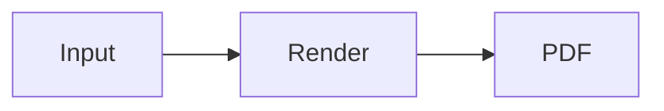
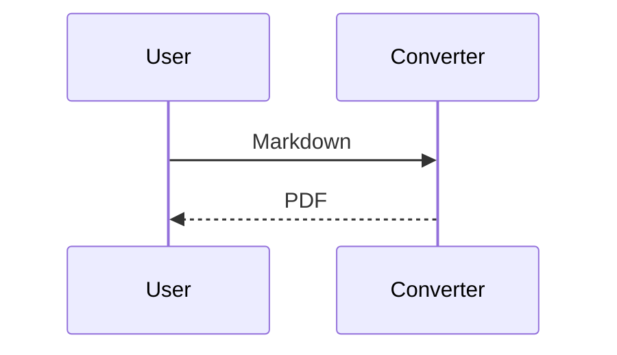

# MD Changer Agent Skill Guide

Use Python 3.13 or newer. In the project directory, run `uv sync --group build`. Before the first source/uvx conversion install Chromium with `uv run playwright install chromium`; for project-local bundled Chromium, first set `$env:PLAYWRIGHT_BROWSERS_PATH = Join-Path (Get-Location) "ms-playwright"` in PowerShell. Keep that absolute environment setting when using uvx. Initial dependency/browser installation requires network access.

## CLI workflow

```powershell
uvx --from . md-changer -i document.md notes/ -o output --theme modern --css custom.css --json
# Equivalent source invocation:
uv run python main.py -i document.md -o output --theme modern --json
```

`-i` / `--input` takes one or more files/directories. Directory discovery is recursive, accepts case-insensitive `.md`/`.markdown` suffixes, and deduplicates resolved paths. `-o` / `--output` defaults to the first discovered file's parent. Existing outputs and duplicate stems use `name.pdf`, `name-2.pdf`, `name-3.pdf`, etc.; never assume the unsuffixed path. Read the returned `pdf` field. `--quiet` suppresses normal progress but preserves JSON.

Choose `--theme default` (existing style / 기본), `modern` (blue headings / 모던), `minimal` (restrained gray / 미니멀), or `report` (navy headings and compact tables / 문서/리포트). Default is `default`. CSS layer order is exactly **common print CSS → selected theme CSS → custom CSS**; normal CSS specificity and `!important` still apply. `--css PATH` reads UTF-8 CSS and validates it before starting Chromium. Theme and CSS apply to every file in the job.

## Mermaid and offline resources

Use fenced blocks with the exact language `mermaid`:

````markdown



````

Other code fences remain code. Mermaid renders with the selected theme and strict security settings before PDF capture; rendering errors or a 30-second completion timeout fail that file and allow the batch to continue. The JavaScript runtime and MIT license are included in wheel/uvx and PyInstaller packages. No CDN is used. Chromium runs offline: remote images/fonts/styles cannot load. Use local resources relative to the Markdown source. Once Chromium is installed, conversion works offline; portable builds bundle Chromium too.

## Result handling

Parse stdout as one JSON object in `--json` mode:

```json
{
  "status": "success",
  "converted_count": 1,
  "failed_count": 0,
  "output_directory": "C:\\docs\\output",
  "theme": "modern",
  "custom_css": null,
  "files": [
    {"source": "C:\\docs\\document.md", "pdf": "C:\\docs\\output\\document.pdf", "status": "success", "error": null}
  ]
}
```

Top-level `status` is `success` for all-success, `partial` for mixed outcomes, or `error` when none succeed or the job fails validation/startup. Each file has `source`, `pdf` (null on failure), `status` (`success`/`error`), and `error` (null on success). `custom_css` is the resolved CSS path or null. Job-level errors include `message`, an empty `files` array, and zero counts; unresolved output directories are null. Diagnostics can also appear on stderr.

Exit code 0 means all files succeeded (or help was requested). Code 1 means partial/total failure, invalid inputs/CSS, browser startup failure, or JSON-mode argument errors. Non-JSON argparse syntax errors use code 2. Inspect both process status and file results; a partial batch retains successful PDFs.

## Python compatibility and detailed API

```python
from pathlib import Path
from md_changer.core import convert_markdown_to_pdf, batch_convert_markdown_to_pdf_detailed

pdf = convert_markdown_to_pdf(Path("document.md"), Path("output"), theme="modern")
batch = batch_convert_markdown_to_pdf_detailed(
    [Path("a.md"), Path("b.md")], Path("output"),
    theme="report", custom_css="h1 { color: navy; }",
    progress_callback=lambda current, total, result: print(current, total, result.success),
)
for result in batch.results:
    print(result.source, result.pdf, result.error, result.success)
```

`custom_css` in Python is CSS **text**, not a path. `BatchConversionResult.results` is an ordered tuple of `ConversionResult(source, pdf, error)`; the batch exposes `converted_count` and `failed_count`. File failures become results, while theme/browser startup and callback exceptions propagate.

Existing `build_html(markdown_text, source_path, custom_css=None)` and `convert_markdown_to_pdf(input_file, output_folder, browser=None)` positional calls remain compatible; `theme` and the converter's `custom_css` are keyword-only. The legacy `batch_convert_markdown_to_pdf(input_files, output_folder, progress_callback=None)` still returns `list[Path]`, stops on the first error, and calls `(current, total, input_file, pdf_path)`. `PDF_CSS` remains available.

## GUI and packaging

Launch `uv run python main.py` without arguments or `uv run md-changer-gui`. Add/drop files, remove selected files or clear the list, select an output directory, choose a theme, and optionally select/clear a CSS file. Convert starts a background job; editing controls are disabled while busy. Completion reports success/failure counts and per-file errors.

Run `uv run python -m unittest discover -s tests -v` and verify the fixture with `uv run python main.py -i tests/fixtures/mermaid_sample.md -o test_output --theme modern --json`. `build.ps1` validates nonempty Mermaid runtime/license, installs local Chromium if needed, runs all tests, then builds with PyInstaller. Distribute all of `dist/md_changer`, including the executable, `_internal/md_changer/assets`, and `_internal/ms-playwright`. Wheel/uvx includes Mermaid assets; Chromium is separately installed.
