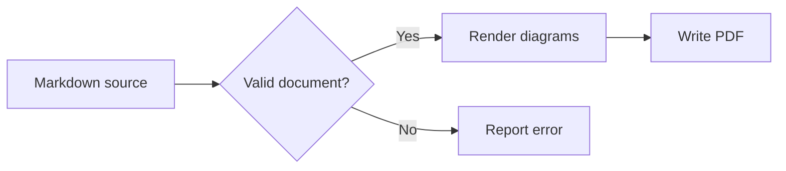
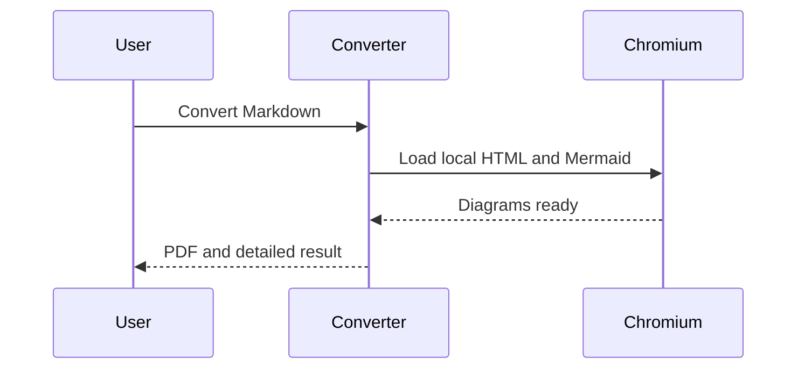

# Mermaid PDF Sample

This document combines a flowchart and a sequence diagram with ordinary Markdown.

## Conversion flow



## Batch sequence



| Feature | Expected result |
| --- | --- |
| Theme | Modern blue headings and diagram colors |
| Network | Offline rendering with bundled Mermaid |

```python
print("Ordinary code stays code")
```
